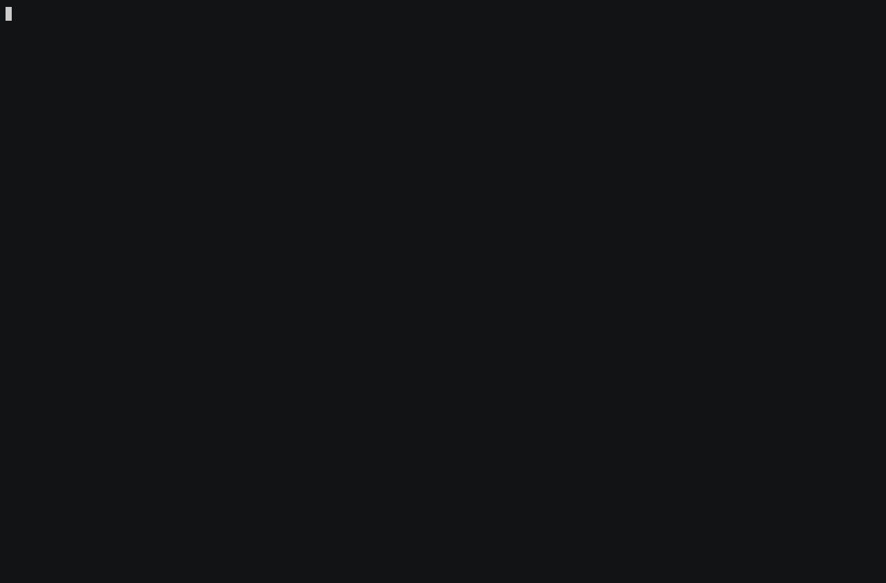

# thurbox-annotate

[](https://github.com/spscream/thurbox-annotate/actions/workflows/ci.yml)
[](https://github.com/Thurbeen/thurbox/releases/tag/v2.22.4)
[](LICENSE)

Review a coding agent's output inside [thurbox](https://github.com/Thurbeen/thurbox)
and send it numbered feedback — the [herdr-annotate](https://github.com/plannotator/herdr-annotate)
idea, wired into thurbox's own panes. It comes in two tiers, like herdr:

- **Full** — press a key on any session and its terminal output opens in
  [plannotator-tui](https://github.com/plannotator/plannotator-tui): drag to
  select a line, comment on it, and press `E`. The comments are delivered
  straight back into that agent's composer as a numbered list — as if you had
  typed the review yourself.
- **Lite** — no external program. Drag to select a line in the agent, press
  `F2`, type a comment; repeat to build a list, then send it all back with `E`.
  A single small pane, entirely in Lua.

Either tier delivers the same thing: a numbered review typed into the agent's
composer. Full renders the source as a document to annotate; Lite is a lighter
in-terminal notepad against the live selection.



*`F5` opens the review, `c` comments on the flawed line, `E` sends it — and the
numbered feedback lands in the agent's composer, which echoes it straight back.*

| Pane | Slot | What it draws |
|---|---|---|
| `plugins/40_annotate.lua` | `center` (switch) | **Full tier.** A program pane hosting plannotator-tui on the selected session's captured output. Brought forward by its **Review** pill or `F5`; delivers feedback with `session send`. |
| `plugins/41_notes.lua` | `center` (switch) | **Lite tier.** A notes pane: the mouse selection, a comment on it, an accumulating list you classify (`c`), delete (`x`) and archive (`a`/`Tab`/`u`). Comment on the selection with `F2` (a global chord, so it fires from the focused agent); send the list with `E`. No external program. |

Both share the `center` slot with the agent pane and draw nothing until you bring
one forward, so they add no column and need **no `layout.lua` edit**. Install
only the tier you want — the two are independent.

## How it works

A thurbox pane cannot spawn a process with a custom environment, so the herdr
contract is assembled by two small shipped scripts instead:

- **`bin/pt-launch.sh`** — the pane runs this as its program. It captures the
  session's output (`thurbox-cli session capture`) into a markdown file, sets the
  `HERDR_*` / `PLANNOTATOR_TUI_*` environment plannotator-tui reads, and `exec`s
  it on that file.
- **`bin/pt-deliver.sh`** — plannotator-tui delivers a review by running
  `$HERDR_BIN_PATH agent prompt <pane> <feedback>`. This shim is that binary; it
  translates the call into `thurbox-cli session send <pane> <feedback>`, which
  types the feedback into the target session as one bracketed paste.

## Install

### 1. The plannotator-tui binary

```bash
scripts/install-plannotator.sh        # downloads + checksums the release binary → ~/.local/bin
```

It is a standalone MIT program; nothing is built here. `~/.local/bin` must be on
the `PATH` thurbox is started with, so the launcher can find it.

### 2. The pane

```bash
thurbox-cli plugin install git+https://github.com/spscream/thurbox-annotate --as plugins/40_annotate.lua
```

This clones the repository into `~/.config/thurbox/ui/thurbox-annotate/` — the
pane, the launcher and the shim together — and writes one `plugins.toml` entry.
No `layout.lua` edit is needed. `thurbox-cli plugin check` should then list
`annotate` beside the panes thurbox ships.

## Capability

`40_annotate.lua` declares `program`, because plannotator-tui is a program it
runs. Grant it per file in settings → Interface (`Ctrl+,` → `]` → select
**annotate** → `t`); until then the pane draws an honest "trust me" state instead
of a terminal.

## Use

1. Select a session in the list.
2. Press `F5` (or its **Review** pill) — plannotator-tui opens on that agent's
   captured output.
3. Drag to select a line, comment, repeat.
4. Press `E` — the numbered feedback lands in that agent's composer.
5. `F5` again closes the review and hands focus back.

## Lite tier

`plugins/41_notes.lua` is the whole tier — no binary, no capability. Install it
the same way:

```bash
thurbox-cli plugin install git+https://github.com/spscream/thurbox-annotate --as plugins/41_notes.lua
```

Then:

1. Drag to select a line of the agent's output.
2. Press `F2` — the pane comes forward with that line quoted and a comment
   field. Type the comment, press `Enter` to save it. The chord is global, so it
   fires while the agent is focused; the selection is grabbed at the keypress.
3. Repeat to build the list, then manage it — a cursor moves with `j`/`k`; `c`
   cycles the selected note's classification (Issue / Suggestion / Note /
   Praise); `x` deletes it; `a` archives it and `Tab` shows the archive, where
   `u` restores. `d` clears the current list. This mirrors herdr-annotate's
   `Ctrl+B M` manager, minus the clipboard export the Lua sandbox cannot reach.
4. Press `E` — the active notes are typed into the selected session's composer
   as numbered, classified feedback (`[Issue] > quote`), the same delivery the
   Full tier uses. The archive stays behind; only the review is sent.

**Requires a thurbox that publishes the selection.** The pane reads the mouse
selection from the shared store key `selection.text`. Stock thurbox keeps the
selection only for its own copy, so on an unpatched build the selection is always
empty and `F2` has nothing to quote. The one-line kernel change that exposes it
(`feat(core): mirror the text selection into the shared store for Lua panes`)
lives on the fork and is not yet upstream; the Full tier needs no such change.

## Checks

- **Lua and shell** — `selene` against `thurbox.yml` (the plugin VM's real
  standard library, so a pane reaching for something the sandbox withholds is a
  lint failure); `stylua --check`; `shellcheck` on the two scripts.
- **Interface loads** — `ci/assemble-interface.sh` builds the directory a real
  install produces (thurbox's `ui/` as the base, this repository cloned beside
  it) and runs `thurbox-cli plugin check`. A pane that loads but that nothing
  places exits non-zero.

Both run against the release named by `THURBOX_TAG` in the workflow. Locally:

```bash
git clone --depth 1 --branch v2.22.4 https://github.com/Thurbeen/thurbox .thurbox
cp .thurbox/thurbox.yml .          # what selene.toml's `std = "thurbox"` resolves to
selene plugins && stylua --check plugins && shellcheck bin/*.sh scripts/*.sh
ci/assemble-interface.sh .thurbox build/ui
THURBOX_UI_DIR=$PWD/build/ui thurbox-cli plugin check
```

## Licence

MIT. plannotator-tui is a separate MIT project; this repository ships none of its
code, only downloads its released binary.
